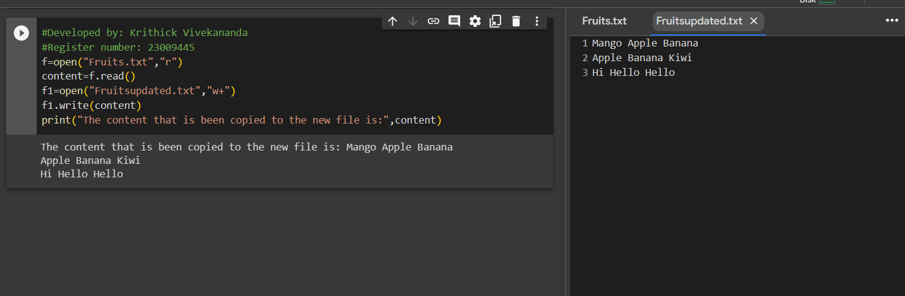

# Copy-file
## AIM:
To write a python program for copying the contents from one file to another file.
## EQUIPEMENT'S REQUIRED: 
PC
Anaconda - Python 3.7
## ALGORITHM: 
### Step 1:
Create a file using Notepad with the extension .txt .


### Step 2: 
Open Google Colab and mount the drive for using the created file in the Colab.


### Step 3: 
Now open the text file in read mode.

### Step 4:  
Then read the content in the file and store the data in a variable.
### Step 5: 
Now open the new uncreated or an empty file using a different file object, by "w+" mode and write the content derived from first file using write().

### Step 6:
 End the program

## PROGRAM:
```python
#Developed by: Krithick Vivekananda
#Register number: 23009445
f=open("Fruits.txt","r")
content=f.read()
f1=open("Fruitsupdated.txt","w+")
f1.write(content)
print("The content that is been copied to the new file is:",content)
```

### OUTPUT:
1) File


2) Mount Colab


3) Output




## RESULT:
Thus the program is written to copy the contents from one file to another file.